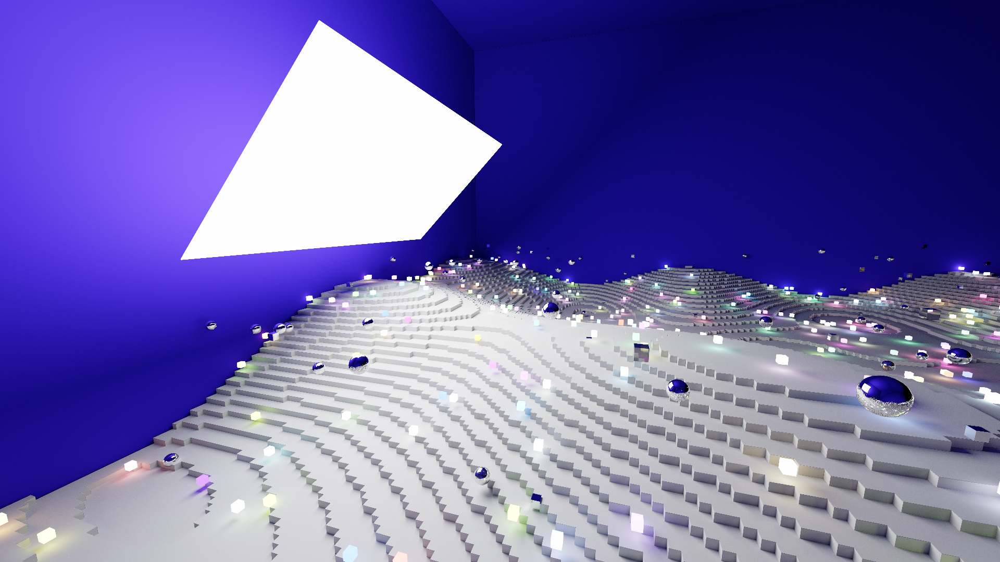
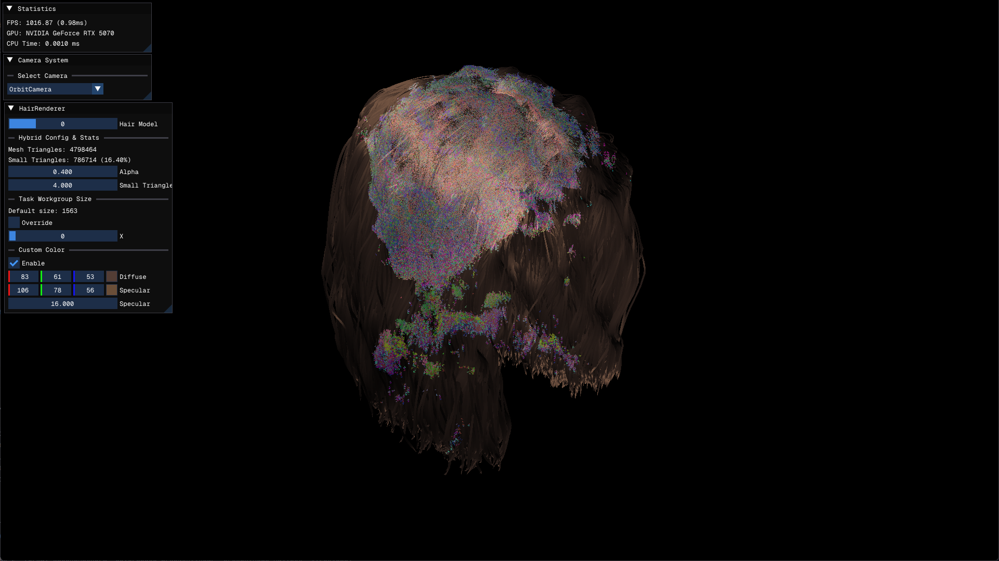
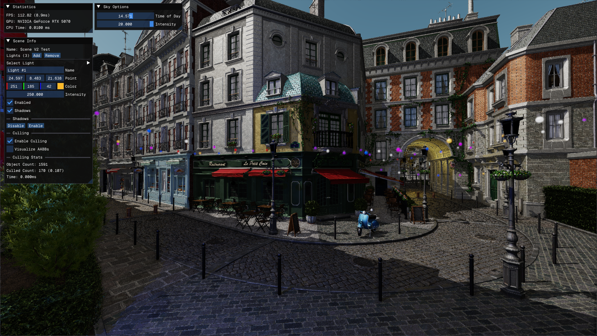
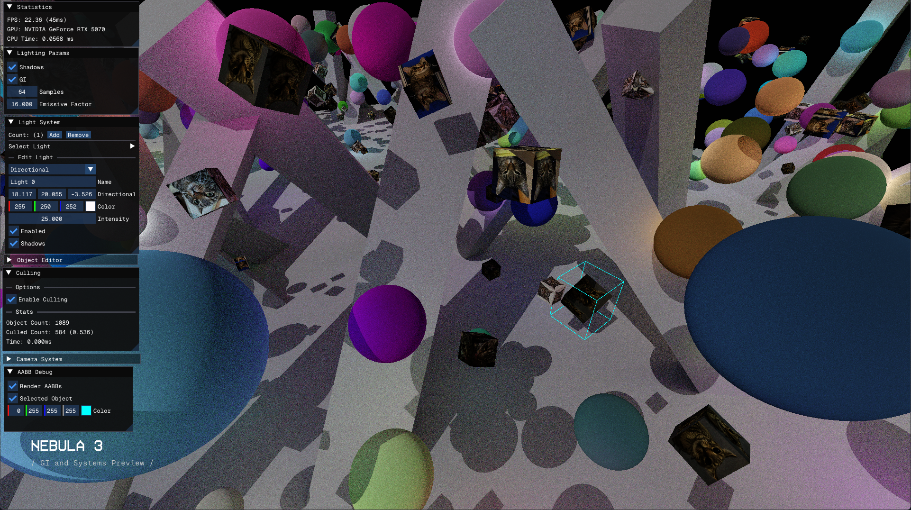

## Nebula
A cross-platform rendering engine built with Vulkan.

  

Ray Tracing Pipeline MIS Path Tracer with Mirrors and Dielectrics

  

[Preview] GPU-driven hybrid hair rendering (mesh shader, compute rasterizer)

  

Bistro Scene with RT Shadows

  

[Experiment] Single-bounce diffuse GI with Ray Queries

### Features
- Supports Windows and macOS
- GPU-driven rendering
- Vulkan raytracing support
- User interface with ImGui
- GLTF loading
- Gamepad Support
- Basic Scene system
  - Slot pools with generational handles for data management
  - Geometry
    - Single Vertex and Index buffer
    - Bottom-Level AS management with a single backing buffer
  - Per-geometry batched instanced rendering
  - Texture System
  - Materials System
  - Top-Level AS Management
    - Compute-based data updates using the existing instance data
    - Used for PT, GI, shadows, ambient occlusion and object selection
- Experimental voxel terrain generator for test scenes
- Rendering techniques
  - Ray tracing pipeline-based MIS path tracer with support for any BSDF. 
    - Current BSDFs: Diffuse, Mirror, Dielectric
  - Deferred shading
  - Screen-space and raytraced ambient occlusion
  - Raytraced shadows
  - PBR Lighting
  - Anti-aliasing (FXAA)
  - Procedural Sky
  - Multiple lights, Runtime editing via UI
  - Frustum Culling
    - Debug Shader for AABB visualization
  - Tone Mapping (currently AgX)
  - Single-bounce GI Experiment → Indirect Diffuse Lighting
